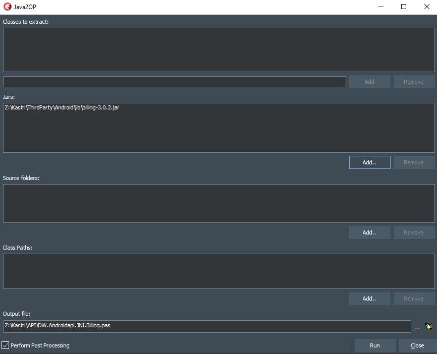
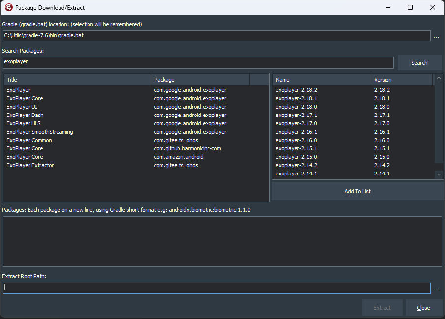

# Android Tools

## ADB Connect


Establishes a connection with an Android device that has had the `adb tcpip` command applied. This can be useful where debugging via USB is not possible, or scenarios where the device being connected via USB would interfere with process of debugging.

The first step is to put the device into TCP/IP mode by connecting the device to a machine (which may not be the development machine) via USB, and issuing the `adb tcpip` command, e.g:

```
adb tcpip 5555
```

Now the USB cable can be disconnected from the device, and on the development machine, the ADB Connect function of Codex invoked.

Enter the IP address of the device, or if this action has been used previously, select from the Recent combobox for the relevant IP address and Port.

Pressing the `RETURN` key on the keyboard while in the IP address edit or clicking `Connect` will start the connection process.

Using this technique, you can even debug across networks as long as the IP address is reachable from the development machine, e.g. via port forwarding on the router of the network that the device is connected to.

Once a successful connection is made, right-clicking on the Target node under the Android target platform in Project Manager and clicking Refresh should show the device.

## Build Asset Packs

(Documentation to be added later)

## Build Jar

Allows you to compile Java source into a `.jar` file that can be consumed by Delphi:


This function has been provided as a convenience, to avoid having Android Studio (or other Java development environment) and provide a much simpler method.

Java source files are added via either `Add Folder..`, which will include all Java source files in the folder (top level only) or add individual files via the `Add..` button.

Jar files that the Java source is dependent on can be added using the `Add..` button under the Dependent Jars list box.

If the source files are compatible with a particular version of Java, use the `Source` combobox to select the relevant version.

If the Java code is compatible with a particular JRE, select the oldest compatible version in the `Target` combobox.

At present, generally these two combo boxes can be left at a value of `1.7` (the defaults)

In the `Output file` edit, enter/select the path and filename that the Java will be compiled to.

Once all the required settings have been entered, the `Save` button will enable, allowing the current configuration to be saved. Kastri has a number of pre-built configuration files, specifically for jars used by Kastri, in the [Java folder of the Kastri repo](https://github.com/DelphiWorlds/Kastri/tree/master/Java). You could use these as a guide when building your own `.jar` files, or when needing to rebuild them if you make your own changes to the Kastri Java source.

Click the `Build Jar` button to build the `.jar` file. The resulting file can then be added to your Android project under the `Libraries` node of the 'Android 32-bit' target in Project Manager. **Presently, the jars need only be added to the `Android 32-bit` target as the Delphi IDE "knows" to use them for `Android 64-bit`.

## Java2OP

A "front-end" for the Java2OP command-line tool that creates imports for Java classes:



Each section relates to the equivalent command line options, so please use the [Java2OP documentation](http://docwiki.embarcadero.com/RADStudio/Sydney/en/Java2OP.exe,_the_Native_Bridge_File_Generator_for_Android) for reference.

The `Perform Post Processing` option includes: 

* Removal of declarations that are suspected of being internal
* Fixes the `unit` declaration to remove the absolute filepath (if it exists)

**Note that Java2OP may still have issues in the classes that it imports** e.g. some methods may be declared in the xxxxClass interface and flagged with `{class}` even though they are actually instance methods so **please check the imports against the documentation (if available).** 

## Logcat Viewer

Launches [Device Lens](https://github.com/DelphiWorlds/DeviceLens), if installed, or opens the default browser to the Device Lens repo.

It was intended to have the Device Lens functionality integrated into the IDE, however this plan has been shelved indefinitely.

## Package Download

This function uses [Gradle](https://gradle.org) to download Android packages and their dependencies, so Gradle will need to be installed on your machine first. Visit [this link](https://gradle.org/releases/) and click the link that says `complete` (i.e. not `binary only`) in the latest version of Gradle to download it, then install Gradle.

In the `Gradle` edit of the Android Packages window, enter or select the path to `gradle.bat` (as per the label, the selection will be remembered).

In the `Packages` memo, enter the Gradle short (Groovy) reference(s) for the package(s) each on a new line. If you don't know the reference, enter the name of the package in the `Search Packages` edit and click `Search`. This will query [mvnrepository](https://mvnrepository.com/) for packages matching the name, e.g. if you enter `exoplayer`, click `Search`, select the first result in the packages list, then select the first version found:



Clicking `Add To List` adds the short reference for the selected name/version. 

Enter/select a path for Extract Root Path, then click `Extract` to extract the package and all its dependencies. 

This process automatically creates a gradle project and downloads/extracts to the nominated path. Codex organizes the packages into a folder structure like this (truncated for brevity):


i.e. each package that has contains resources (as opposed to only a `.jar` file) is in a separate folder, and the associated `.jar` file is in the root. 

The `Add Android Package` function (in the Project Manager context menu) of Codex uses this folder structure to merge the resources, create a manifest "merge" file, creates a `.jar` file that contains "R" classes, and the jar is added to the project.


