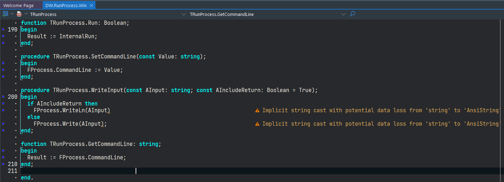
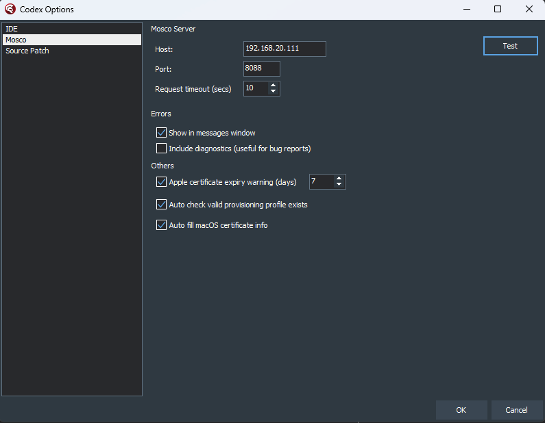
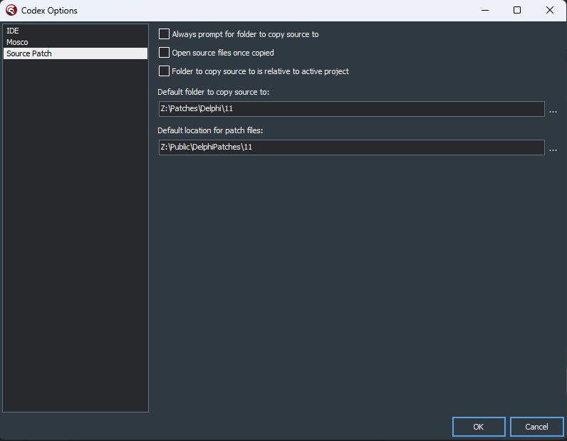

# Codex Options

Codex options can be accessed via the IDE menu, in: Tools | Codex > Options

## Delphi IDE enhancements

These enhancements can be enabled/disabled in the Options, unless specified otherwise:

### Load last opened project

When Delphi starts, the last project/group that was loaded should load.

### Show Project Manager when opening a project or group

As per the title, the Project Manager is shown (if not already) when a project or group is opened

### Display warning for App Store build type when using Run With Debugging

Sometimes you may build for App Store, then forget what it was set to when you next attempt to debug. This feature warns you before compiling starts, because the debugger will not start when the project is set to this build type.

### Show Platform > Config > Build type caption in title bar

When the tree in the Project Manager is collapsed, or it is simply out of view, this feature allows you to see at a glance what the current selection is. The caption appears in the title bar, like this:

### Hide View Selector

The View Selector is the combination of two combo boxes in the top right of the edit window when an FMX form is showing. If you never use the selector, this option can reclaim some space in the edit window.

### Enable Read Only editor popop menu item

In Delphi 10.4, a change was made to the IDE to disable the read-only menu option in the editor popup, when the source file is marked as read-only. This prevents the developer from "trying out" changes directly in the IDE without having to unset the read-only flag on the physical file. This option re-enables the item.

### Suppress project build events warning

This option prevents the IDE from warning about build events being present in a project when it is loaded

### Show Error Insight messages in the editor

Codex can display hints/warnings/errors right in the IDE, if the Structure window has been shown for the active unit:

### Kill the project process if it is running

If a process with the same path/name is already running, Codex will kill the task. If run without debugging is used, then later if using run with debugging, the process from earlier may still be running 

## Mosco

These are the options for Codex integration with [Mosco](https://github.com/DelphiWorlds/Mosco) (a macOS app that can aid macOS/iOS developers):

Any messages generated by the Mosco integration will appear in the **Mosco tab of the Messages window in the Delphi IDE**.

### Mosco Server

Set the value for Host to the hostname or IP address of where Mosco is running, and the Port value for the Port. In Mosco itself, you can check which IP addresses and Port it is listening on, in its Messages window:

### Errors 

These checkboxes determine whether relevant error messages are shown.

### Apple certificate expiry warning

Codex can use Mosco to check whether the Mac that Mosco is running on, whether it has any certificates that are about to expire.

### Auto check valid provisioning profile exists

When a project has an active target of iOS or macOS, Codex checks whether or not a valid provisioning profile exists.

### Auto fill macOS certificate info

When a project has an active target of macOS, it can auto-fill the certificate info with the relevant data, if it is not already filled in:

## Source Patch

These options apply to the [Editor Context menu](EditorContextMenu.md):

### Always prompt for folder to copy source to

When checked, Codex will always prompt for the folder to copy Delphi source files to. This is used in combination with the Default folder to copy source to edit.

### Open source files once copied

Checking this option results in the copied Delphi source file being opened in the editor if it is not already opened

### Folder to copy source to is relative to active project

Used in combination with the Default folder to copy source to edit. This will result in the source being copied to a folder that is relative to the path for the source of the active project

### Default folder to copy source to

This indicates which folder to copy the Delphi source file to. When Always prompt.. is checked, the save dialog will start in this folder

### Default location for patch files

When using the `Create patch file` or `Apply patch file` items in the Editor Context menu, this is the folder that Codex will default to when using these commands 