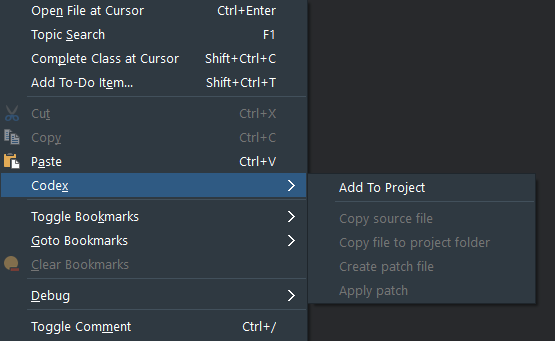

# Editor Context Menu

Codex adds a number of menu items to the Editor Context menu in the IDE:

## Add To Project

This allows you to add the opened source file to the project if it has not already been added.

## Copy source file

If the file is located in the Delphi source folders (it is otherwise disabled), this file is copied to the folder nominated in the Codex Options (`Default folder to copy source to`), or will prompt for the folder if the default folder does not exist, or the `Always prompt for folder to copy source to` option is checked

## Copy file to project folder

If the file is located in the Delphi source folders (it is otherwise disabled), the file is copied to the root folder of the currently active project
  
## Create patch file 

Creates a diff between the file and a matching source file. If a matching source file cannot be found, it will prompt for the location. Once a match is found, it will prompt for a patch file name (defaulting to the format described above), using the default folder selected in the Codex Options (`Default location for patch files`) if available

## Apply patch

Prompts for a patch file using the default folder selected in the Codex Options (`Default location for patch files`) if available, and applies it to the file in the editor

**Note: The last 2 items require [Git](https://git-scm.com/) to be installed on the machine before the items will enable**

