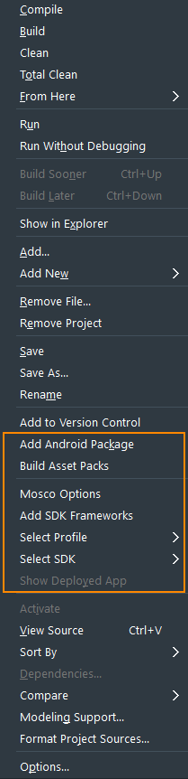
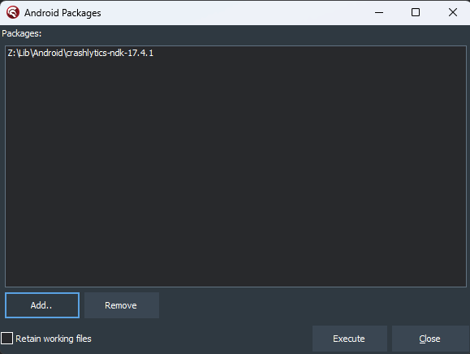
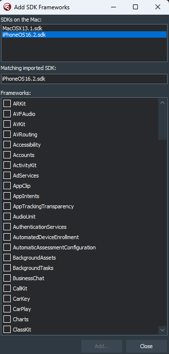
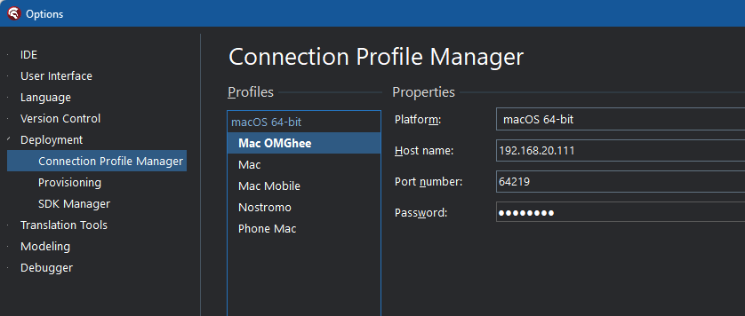
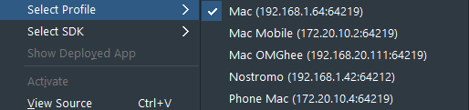
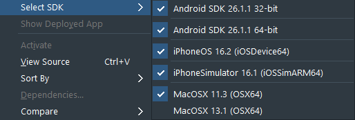

# Project Manager Context Menu

Codex adds several items to the context menu of Project Manager, which appears when you right-click the root node of your project in Project Manager:



## Add Android Package

Adds a Android packages that were downloaded using the [Package Download](AndroidTools.md#package-download) function in the Android Tools menu. This item will enable if the active project has an Android target platform included. Note that **you must deploy the application at least once** to be able to use this function. 

Once the Android Packages form shows, click `Add..` and select the folder that is the root of a package that was downloaded using Package Download, e.g.:



Then click `Execute` to add the package(s) to your project. The output window will show the progress of the required tasks, and any error messages it encounters. The process:

* Merges Android resources of your project with the resources of the package(s) being added
* Extracts manifest entries from the package(s) that are required to be added to the manifest of your project, and creates "merge" manifests that are named the same as the root of the package folder, with `-Manifest.merge.xml` appended, e.g.: `crashlytics-ndk-17.4.1-Manifest.merge.xml`. See [below regarding merging](#merging-manifest-files) of this file.
* Creates Java sources for any required R classes, and compiles these classes into a library named the same as your project, with `.R.jar` appended, and adds this jar file to your project

### Merging manifest files

In order for "merge" files to be merged into the manifest for your project, either:

Use the `manifestmerge` tool from [Kastri](https://github.com/DelphiWorlds/Kastri/tree/master/Tools) in a build event in your projects Project Options, e.g.:

```
$(Kastri)\Tools\manifestmerge . $(Platform)\$(Config)\AndroidManifest.xml
```
(This will merge any files ending in `Manifest.merge.xml` in the project folder with the resulting `AndroidManifest.xml` i.e. it will *not* alter `AndroidManifest.template.xml`)

OR

Examine the "merge" file and manually edit `AndroidManifest.template.xml` in your project

## Build Asset Packs

Documentation to be added later.

## Mosco Options

Shows the options for Mosco integration, as per the [Codex Options](CodexOptions.md#mosco) menu item.

## Add SDK Frameworks

Communicates with the Mosco macOS app to determine which frameworks are available for the relevant SDK, and presents a dialog:



Select the SDK on the Mac you wish to add frameworks from, then select the frameworks you wish to add the matching SDK used by Delphi, and the Delphi SDK Manager will be shown with the frameworks added. Click `Update Local File Cache`, then click `Save` to complete the frameworks addition.

## Select Profile

When you have more than one profile configured in the Connection Profile Manager in the Delphi IDE options:



The Select Profile item will have an entry for each profile, allowing you to easily select a different profile:



## Select SDK

When you have more than one SDK imported for iOS or macOS, this item will have an entry for each SDK, allowing you to easily select a different SDK:



In this example, there are 2 macOS SDKs imported, and MacOSX 11.3 is selected as the active SDK.

## Show Deployed App

For iOS and macOS apps that have been deployed, this function will show the location of the app in Finder on your Mac. For Windows apps, the location will be shown in Explorer.