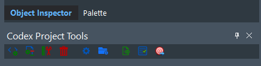
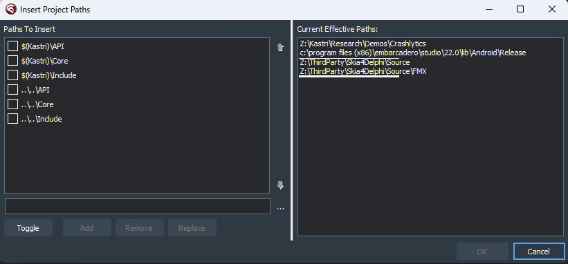

# Project Tools

## Find Unit

Searches the current effective paths for units matching the name in the edit. Useful for tracking down duplicate units in the path.

## Show Effective Paths

Shows the paths that the compiler will use for the platform and configuration for the active project.

## Show Tools

Shows the Codex Project Tools window. This is a view of the window when docked in the IDE.

If the Codex Project Tools window is undocked, the Show Tools menu item will bring it to the front

The items in the toolbar apply to the active project, and from left to right are:

* Compile
* Build
* Clean
* Total Clean - deletes all output folders for all platforms for the active project. **Use this item with caution**
* Project Options - shows the Project Options window
* Insert paths into Project Options - [see below](#insert-paths-into-project-options-item)
* View project source - opens the project source in the editor (same as View Source in the Project Manager context menu)
* Show Deployment Manager - shows the Deployment Manager window
* Deploy - performs the same function as Project | Deploy from the IDE menu

### Insert paths into Project Options item

A convenient way of adding search paths into your project. Clicking this item brings up this window, e.g.:

The Current Effective Paths list shows which paths will apply to the project for the current platform and configuration. These include search paths from the IDE options, and the current search paths for the project.

When Codex is first installed, the Paths To Insert listbox will be empty. Type a path into the edit box below it, and click `Add` to add an item to the list. Check the checkbox next to an item to include it as a path to be inserted into the search path in the Project Options.

**NOTE:** This function adds search paths to the **base** configuration for the project, i.e. for **all** platforms / **all** configurations. Later versions of Codex may have the option to select different platforms / configurations.

