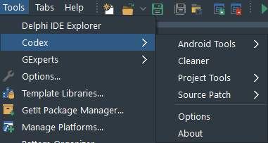

# Codex Documentation

## Menu items

Codex inserts menu items under the `Tools` option in the Delphi IDE:



The following are links to the documentation for the respective items:

* [Android Tools](AndroidTools.md)
* [Cleaner](Cleaner.md)
* [Project Tools](ProjectTools.md)
* [Source Patch](SourcePatch.md)
* [Options](CodexOptions.md)
<br/>

## Editor context menu

[This is a link](EditorContextMenu.md) to information about what Codex adds to the editor context menu.

## Codex Toolbar

Codex installs a toolbar into the IDE that provides shortcuts to existing IDE functions and Codex functions:


The buttons from left to right, are:

* Jump to interface section of a unit
* Jump to implementation section of a unit
* Show the Environment Variables IDE options page
* Show the SDK Manager IDE options page
* [ADB Connect](AndroidTools.md#adb-connect)

**Note: The Deploy Project button has been moved to the [Codex Project Tools window](ProjectTools.md#show-tools)**
  
To include the toolbar in the IDE, right click the IDE toolbar area and check the Codex popup menu item

## Post Deployment functions

### PList Merge (iOS)

When an iOS app is deployed, if a file named `info.plist.TemplateIOS.merge.xml` is present in the *same folder* as the project, Codex watches the output folder for when the `(projectname).info.plist` file is generated (where `(projectname)` is the name of your project), and if it has not been merged already, merges `info.plist.TemplateIOS.merge.xml` with that file. This relieves the need for creating a custom info.plist file, having to add it to the deployment, editing it later etc. 

The merge file should follow the same format as an info.plist, i.e. the parent node is `<plist>`, followed by a `<dict>` node, and contain key/value pairs. For example, the merge file may look like this (for merging Facebook login entries):

```
<plist>
  <dict>
    <key>CFBundleURLTypes</key>
    <array>
      <dict>
        <key>CFBundleURLSchemes</key>
        <array>
          <string>fb123456789012345</string>
        </array>
      </dict>
    </array>
    <key>FacebookAppID</key>
    <string>585555335933054</string>
    <key>FacebookClientToken</key>
    <string>17ddd46ff46f919b72dd7ddd6408139a</string>
    <key>FacebookDisplayName</key>
    <string>Delphi Worlds Login Test</string>
    <key>NSAppTransportSecurity</key>
    <dict>
      <key>NSAllowsArbitraryLoads</key>
      <true/>
      <key>NSExceptionDomains</key>
      <dict>
      <key>facebook.com</key>
      <dict>
        <key>NSIncludesSubdomains</key>
        <true/>
        <key>NSExceptionRequiresForwardSecrecy</key>
        <false/>
      </dict>
      <key>fbcdn.net</key>
      <dict>
        <key>NSIncludesSubdomains</key>
        <true/>
        <key>NSExceptionRequiresForwardSecrecy</key>
        <false/>
      </dict>
      <key>akamaihd.net</key>
      <dict>
        <key>NSIncludesSubdomains</key>
        <true/>
        <key>NSExceptionRequiresForwardSecrecy</key>
        <false/>
      </dict>
      </dict>
    </dict>  
    <key>LSApplicationQueriesSchemes</key>
    <array>
      <string>fbapi</string>
      <string>fbapi20130214</string>
      <string>fbapi20130410</string>
      <string>fbapi20130702</string>
      <string>fbapi20131010</string>
      <string>fbapi20131219</string>
      <string>fbapi20140410</string>
      <string>fbapi20140116</string>
      <string>fbapi20150313</string>
      <string>fbapi20150629</string>
      <string>fbapi20160328</string>
      <string>fbauth</string>
      <string>fb-messenger-share-api</string>
      <string>fbauth2</string>
      <string>fbshareextension</string>
    </array>
  </dict>
</plist>
```

Merging will override existing values, e.g. the key/value pair:

```
  <key>NSAllowsArbitraryLoads</key>
  <true/>
```

May already exist, and the value `<true/>` will replace the existing value (which is probably `<true/>` anyway, however this should give you an idea of what to expect).

Key/value pairs in the merge file that do not exist in the `(projectname).info.plist` file will be added.

### Commands

This differs from the PList Merge function as it does not involve watching for file changes.

If a file called `PostDeploy.command` is present in the same folder as the project source, Codex will execute the command. The command in the file needs to be a single line, and can contain the following macros:

* `$(EXEOutput)` - will be replaced with the path that the executable is output to
* `$(SanitizedProjectName)` - will be replaced with the santized project name for the project

The line can also contain any of the environment variables which are normally set when `rsvars.bat` is run. 

Here's an example of the contents of a `PostDeploy.command` file:

```
$(BuildTools)\apksigner.bat sign --ks %APPDATA%\Embarcadero\BDS\$(ProductVersion)\debug.keystore --ks-pass pass:android $(EXEOutput)\$(SanitizedProjectName)\bin\$(SanitizedProjectName).apk
```

