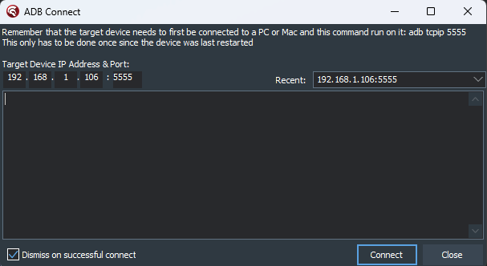
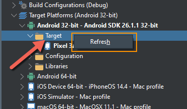
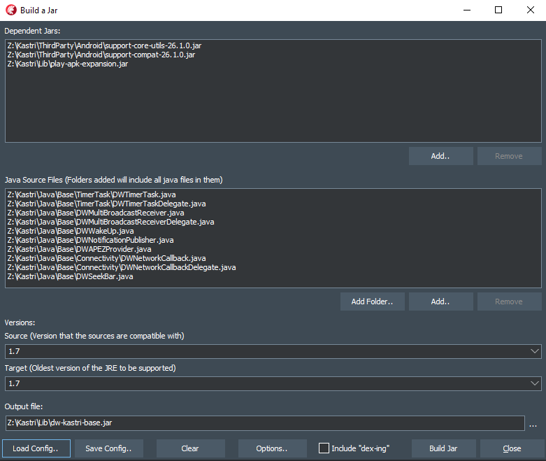
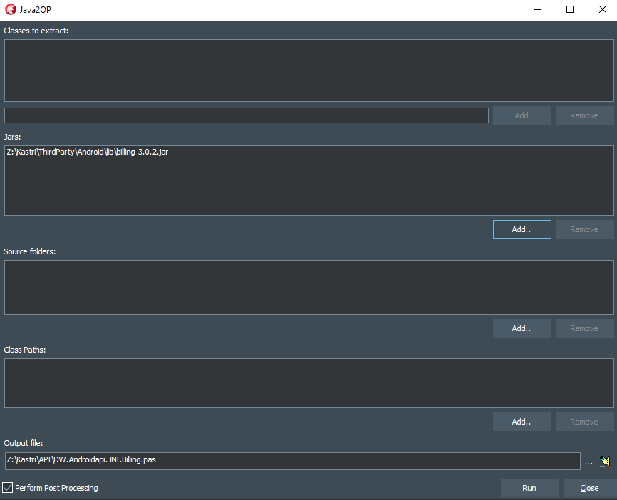
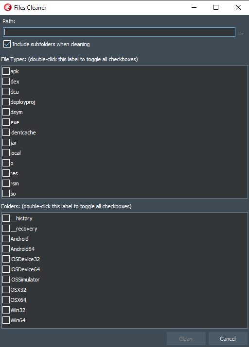
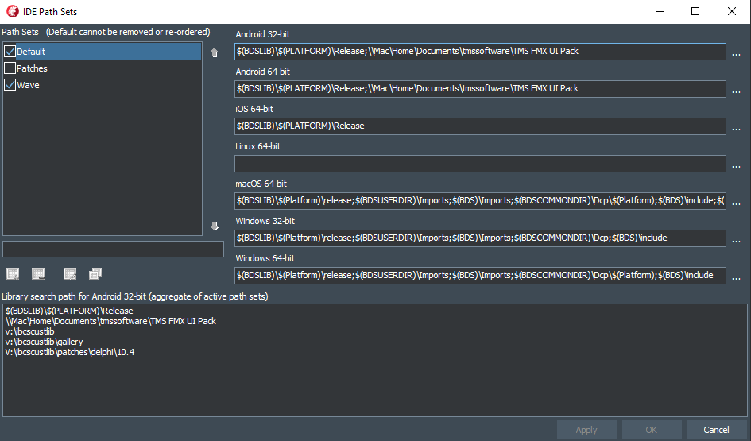
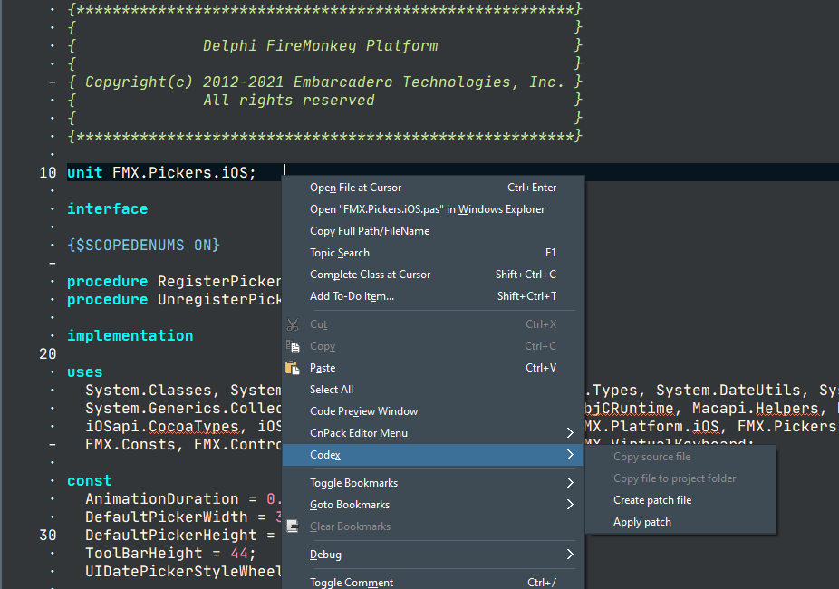
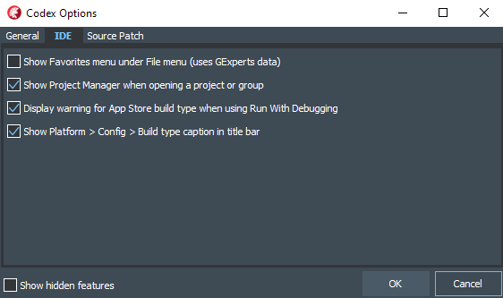

# Codex

This repository is for documentation, the installers and for reporting issues

## Description

### Codex:

* Is an expert that can be installed into the Delphi IDE
* Helps boost your productivity
* Installs under the Tools menu
* Is completely free
* Supports Delphi 10.4 Sydney, Delphi 10.3 Rio (v1.3.1 and below), Delphi 10.2 Tokyo (v1.2.0 only), and Delphi 10.1 Berlin (v1.0.0 only)

## Features

### Android Tools (Tools > Codex > Android Tools)

#### ADB Connect

Allows you to connect to Android device over the network (local or internet). When an Android device is put into TCP/IP mode (which can be done via [Device Lens](https://github.com/DelphiWorlds/DeviceLens) - see the notes in the readme, or via the [command line](http://docwiki.embarcadero.com/RADStudio/Sydney/en/Running_and_Debugging_Your_Android_Application_On_a_Remote_Android_Device)), the Android Debug Bridge (ADB) can connect to the device from another IP address, such as on the machine on which you have Delphi installed.

Ensure the device is in TCP/IP mode, enter the IP address and port (defaults to 5555) and click Connect. Once the device has connected, in Project Manager, right-click on `Target` under the Android platform, and click `Refresh`. The device should then show under the `Target` node:

If the device is on another network (somewhere across the internet), you will need to set up [Port Forwarding](https://www.noip.com/support/knowledgebase/general-port-forwarding-guide) on the router for the network that the device is connected to.

#### Build Jar

This function gives a "quick and dirty" option for compiling Java code (as opposed to using Android Studio) into a jar file.

This is useful if you need to create Java classes that are descendants of other Java classes, as it is not yet possible to do so in Delphi, however you can then consume these descendants in your Delphi code. Once your jar is built, you can use the Java2OP front end in Codex to import the Java classes into Delphi code.

Configurations can be saved so that they can be loaded later if you need to rebuild the jar after a change. 

Build Jar can also be used to rebuild fmx.jar, which may be necessary if there is an issue that requires a change to the FMX java code, e.g. [this issue](https://quality.embarcadero.com/browse/RSP-21841) (which is now fixed) or if you want to make a change yourself. A pre-built configuration for fmx.jar for **Delphi 10.4.2** is [located here](https://github.com/DelphiWorlds/Codex/blob/master/Config/fmx.jar.10.4.2.json). You will need to modify the configuration if Delphi is installed on a 32-bit machine, or somewhere other than the default, and you will need to add the Output File value to suit. If you are going to change the Java source, I recommend making a copy and placing it in a different location, then modify it. This will mean that you will need to update the paths for the Java source in the config.

#### Java2OP

A "front-end" for the Java2OP command-line tool that creates imports for Java classes:

Each section relates to the equivalent command line options, so please use the [Java2OP documentation](http://docwiki.embarcadero.com/RADStudio/Sydney/en/Java2OP.exe,_the_Native_Bridge_File_Generator_for_Android) for reference.

The `Perform Post Processing` option removes declarations that are suspected of being internal.

**Note that with the current version of Java2OP, it incorrectly emits the full path to the output file as the unit name in the generated source, so you will need to manually resolve this**

#### LogCat Viewer

If installed, this item will launch [Device Lens](https://github.com/DelphiWorlds/DeviceLens), otherwise it will open a browser to where the installer is located.

### Files Cleaner (Tools > Codex > Cleaner)

Removes auto-generated files from folders, thus saving disk space and allowing you to zip folders without too much "baggage"

Note: This is presently a **destructive delete**, i.e. the files are **not** sent to the recycle bin

A future enhancement will allow configuration of included file types.

### IDE Configuration (Tools > Codex > IDE Config)

#### Path Sets

Path Sets allow quick changes to IDE search paths. You might find this useful if you work on projects for more than one client who use IDE search paths, rather than using project search paths, and you would rather exclude those paths when not working on those projects.

A path set comprises search paths for each of the supported platforms. The Default path set is the one that the IDE would use if you were not using path sets, and cannot be removed (but can be edited)

To add a set, enter a name for the set in the edit below the path set list, and click the Add button.

To include a set in the effective paths, check the checkbox next to the name in the list. This causes the path set to be included in the effective paths, which is an aggregate of the "active" path sets.

Path sets can be reordered so that the paths that apply to that set appear before others, by selecting a set and clicking the up/down arrows next to the list

### Source Patch (Tools > Codex > Source Patch)

These menu items perform functions related to creating/applying patches for Delphi source. A repo called [Delphi Patches](https://github.com/DelphiWorlds/DelphiPatches) has been started for patch files intended for use with this function.

#### Copy source files

Presents an open file dialog that starts at the Delphi source folder. Select one or more files and they will be copied to the folder nominated in the Codex Options (`Default folder to copy source to`), or it will prompt for which folder to copy to if the folder does not exist, or the `Always prompt for folder to copy source to` option is checked. Once source files are copied, they will be opened in the code editor if the `Open source files once copied` option is checked.

#### Create patch file

Presents an open file dialog to select which source file copy is to be diffed with existing source. The default folder for source copies can be set in the Codex Options. 

If the original source file cannot be found, it will prompt for selecting the file. 

Lastly, it will prompt for a filename to save the patch file as. The default name for the patch file will be in the format: `[originalname].[version].patch` where `[originalname]` is the original source file name (minus the `.pas` extension), and `[version]` is the version of Delphi being used. 

The default folder for where patch files will be prompted for can also be set in the Codex Options (`Default location for patch files`)

#### Apply patch

Presents an open file dialog to select which patch file to apply to a copy of the source. It will then either prompt for the copy of the source, or automatically apply it to an existing source file if it can be found in the default source file copies folder specified in the Codex Options (`Default folder to copy source to`)

The Source Patch feature is also available in the code editor context menu:

However here it applies to the file currently being edited:

* **Copy source file** - if the file is located in the Delphi source folders (it is otherwise disabled), this file is copied to the folder nominated in the Codex Options (`Default folder to copy source to`), or will prompt for the folder if the default folder does not exist, or the `Always prompt for folder to copy source to` option is checked
* **Copy file to project folder** - if the file is located in the Delphi source folders (it is otherwise disabled), the file is copied to the root folder of the currently active project
* **Create patch file** - creates a diff between the file and a matching source file. If a matching source file cannot be found, it will prompt for the location. Once a match is found, it will prompt for a patch file name (defaulting to the format described above), using the default folder selected in the Codex Options (`Default location for patch files`) if available
* **Apply patch** - Prompts for a patch file using the default folder selected in the Codex Options (`Default location for patch files`) if available, and applies it to the file in the editor

## Codex Options (Tools > Codex > Options)

The options dialog has settings for various options within Codex:

"Show hidden features" when checked shows features that were available in previous versions that have now been hidden because they are not being used, or are now superfluous. If you unhide them and find any useful, please indicate that you'd like to have them shown by default by [adding a request in the issues area](https://github.com/DelphiWorlds/Codex/issues). Note: some features have been removed because they are no longer required because they have been fixed in all supported versions.

Some of the options are self-explanatory, however:

* **Display warning for App Store build type when using Run With Debugging** - it's not actually possible to Run With Debugging when in the App Store build type, so if you've perhaps forgotten what build type was selected and you invoke Run With Debugging, this option will display a warning
* **Show Platform > Config > Build type caption in the title bar** - is another way to remind you exactly what configurations are selected for the active project

For details on the Source Patch options, see the Source Patch section, above

## Change history

v1.4.0 (April 28th, 2021) - Delphi 10.4 ONLY

* Added: Path Sets
* Added: Source Patching
* Some items now hidden pending future updates
* Removed items no longer required
* Various fixes

**Unfortunately, my Delphi 10.3.3 install has "died", so no support for 10.3.x as yet**

v1.3.1 (July 23rd, 2020) - Delphi 10.4 and 10.3 support

* Fixed selection of JDK path in Android Tools
* Modified Logcat Viewer option to launch [Device Lens](http://github.com/DelphiWorlds/DeviceLens) if it exists

v1.3.0 (May 28th, 2020) - Delphi 10.4 and 10.3 support

* Add ADB Connect function - connect to an Android device over the internet!
* Added "Total Clean" function - cleans all files in output folders
* Added support for Delphi 10.4 Sydney

Note: Editor Tabs On Left option has been disabled in Delphi 10.4 for now, until a fix can be worked out

v1.2.3 (December 23rd, 2019) - NOTE: This release is for Delphi 10.3.x ONLY

* Fixed Build Jar function so that packages with a prefix of other than com will build successfully
* Fixed Editor Tabs On Left option so that it can be turned off
* Fixed theming of Android options dialog

v1.2.2 (December 1st, 2019) - NOTE: This release is for Delphi 10.3.x ONLY

* Fixed reliability of editor tabs on the left side

v1.2.1 (October 1st, 2019) - NOTE: This release is for Delphi 10.3.x ONLY

* Updated Image Assets function to support current image sizes
* Removed faulty logcat viewer - please use [Device Lens](http://github.com/DelphiWorlds/DeviceLens)
* Fixed IDE theming for all views
* Minor bug fixes

v1.2.0 (March 5th, 2019)

* Added Feed Alerts feature
* Moved logcat color selection into the LogCat viewer window
* Updated Image Assets feature to support the new image/icon sizes supported by Delphi 10.3.1
* Added option for moving the editor tabs to the left hand side (like they used to be)
* Modified the Options dialog to have multiple pages for different categories

(sorry, history for earlier versions unavailable)

