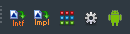

# Codex

This repository is for documentation, the installers and for reporting issues

## Description

### Codex:

* Is an expert that can be installed into the Delphi IDE
* Helps boost your productivity
* Installs under the Tools menu
* Is completely free
* Supports Delphi 11 Alexandria (Codex v1.5 only), Delphi 10.4 Sydney (Codex v1.5 and v1.4), Delphi 10.3 Rio (Codex v1.3.1 and below), Delphi 10.2 Tokyo (Codex v1.2.0 only), and Delphi 10.1 Berlin (Codex v1.0.0 only)

## Features

* [Codex Toolbar](#codex-toolbar)
* [Codex Options](#codex-options-tools--codex--options)
* [Mosco-enabled functions](#mosco-enabled-functions)
* [Android Tools](#android-tools-tools--codex--android-tools)
* [Path Sets](#path-sets)
* [Project Tools](#project-tools-tools--codex--project-tools)
* [Post Deployment functions](#post-deployment-functions)
* [Source Patching](#source-patch-tools--codex--source-patch)
* [Files Cleaner](#files-cleaner-tools--codex--cleaner)

### Codex Toolbar

Codex installs a toolbar into the IDE that provides shortcuts to existing IDE functions and Codex functions:



To include the toolbar in the IDE, right click the IDE toolbar area and check the Codex popup menu item

### Mosco-enabled functions

#### Menu items

A number of functions rely on having the Mosco macOS app running on your Mac, namely these menu items:

* Add SDK Frameworks
* Sign Libraries
* Show Deployed App

Which are added to the Project Manager context menu (right-click the project to show the context menu)

#### Mosco Options

Mosco server and other settings can be changed in the Codex Options dialog:


Host/Port is the hostname or IP address and Port where the Mosco server is running (on the target Mac)

The Errors options controls whether internal errors are shown in the IDE messages window, and whether diagnostic messages are included

#### Add SDK Frameworks

Communicates with the Mosco macOS app to determine which frameworks are available for the relevant SDK, and presents a dialog:

[image]

Select the frameworks you wish to add the SDK, and the Delphi SDK Manager will be shown with the frameworks added. Click `Update Local File Cache`, then click `Save` to complete the frameworks addition.

#### Sign Libraries

Allows you to code sign 3rd party (or your own) libraries that need to be deployed with your iOS or macOS app. Select the libraries to be signed, blah blah etc.!!!!!!!!

#### Show Deployed App

For iOS and macOS apps that have been deployed, this function will show the location of the app in Finder on your Mac

### Android Tools (Tools > Codex > Android Tools)

#### ADB Connect

Allows you to connect to Android device over the network (local or internet). When an Android device is put into TCP/IP mode (which can be done via [Device Lens](https://github.com/DelphiWorlds/DeviceLens) - see the notes in the readme, or via the [command line](http://docwiki.embarcadero.com/RADStudio/Sydney/en/Running_and_Debugging_Your_Android_Application_On_a_Remote_Android_Device)), the Android Debug Bridge (ADB) can connect to the device from another IP address, such as on the machine on which you have Delphi installed.


Ensure the device is in TCP/IP mode, enter the IP address and port (defaults to 5555) and click Connect. Once the device has connected, in Project Manager, right-click on `Target` under the Android platform, and click `Refresh`. The device should then show under the `Target` node:


If the device is on another network (somewhere across the internet), you will need to set up [Port Forwarding](https://www.noip.com/support/knowledgebase/general-port-forwarding-guide) on the router for the network that the device is connected to.

#### Build Jar

This function gives a "quick and dirty" option for compiling Java code (as opposed to using Android Studio) into a jar file.


This is useful if you need to create Java classes that are descendants of other Java classes, as it is not yet possible to do so in Delphi, however you can then consume these descendants in your Delphi code. Once your jar is built, you can use the Java2OP front end in Codex to import the Java classes into Delphi code.

Configurations can be saved so that they can be loaded later if you need to rebuild the jar after a change. 

Build Jar can also be used to rebuild fmx.jar, which may be necessary if there is an issue that requires a change to the FMX java code, e.g. [this issue](https://quality.embarcadero.com/browse/RSP-21841) (which is now fixed) or if you want to make a change yourself. A pre-built configuration for fmx.jar for **Delphi 10.4.2** is [located here](https://github.com/DelphiWorlds/Codex/blob/master/Config/fmx.jar.10.4.2.json). You will need to modify the configuration if Delphi is installed on a 32-bit machine, or somewhere other than the default, and you will need to add the Output File value to suit. If you are going to change the Java source, I recommend making a copy and placing it in a different location, then modify it. This will mean that you will need to update the paths for the Java source in the config.

#### Java2OP

A "front-end" for the Java2OP command-line tool that creates imports for Java classes:


Each section relates to the equivalent command line options, so please use the [Java2OP documentation](http://docwiki.embarcadero.com/RADStudio/Sydney/en/Java2OP.exe,_the_Native_Bridge_File_Generator_for_Android) for reference.

The `Perform Post Processing` option includes: 

* Removal of declarations that are suspected of being internal
* Fixes the `unit` declaration to remove the absolute filepath (if it exists)

#### LogCat Viewer

This item will launch [Device Lens](https://github.com/DelphiWorlds/DeviceLens) if installed, otherwise it will open a browser to where the installer is located.

#### Package Download

Downloads Android packages and *all* their dependencies from the [Maven Repository](https://mvnrepository.com). Enter the URL for the desired package, a target folder to download to, and click Download, e.g for [OneSignal v4.5.1](https://mvnrepository.com/artifact/com.onesignal/OneSignal/4.5.1):


The download process automatically extracts .aar files where necessary

### Project Tools (Tools > Codex > Project Tools)

#### Find Unit

Searches the current effective paths for units matching the name in the edit. Useful for tracking down duplicate units in the path.

#### Insert Paths

Allows insertion of predefined paths into a project. Useful if you find you are often inserting the same paths into projects. 

!!!! Might help to have an image or 2 here

#### Resource Files

!!!! Revisit this - might need to include in 1.5.1

#### Show Effective Paths

Shows the paths that the compiler will use for the active project and configuration (e.g. Debug or Release)

### Post Deployment functions

#### PList Merge (iOS)

When an iOS app is deployed, if a file named `info.plist.TemplateIOS.merge.xml` is present in the *same folder* as the project, Codex watches the output folder for when the `(projectname).info.plist` file is generated (where `(projectname)` is the name of your project), and if it has not been merged already, merges `info.plist.TemplateIOS.merge.xml` with that file. This relieves the need for creating a custom info.plist file, having to add it to the deployment, editing it later etc. 

The merge file should follow the same format as an info.plist, i.e. the parent node is `<plist>`, followed by a `<dict>` node, and contain key/value pairs. For example, the merge file may look like this (for merging Facebook login entries):

```
<plist>
  <dict>
    <key>CFBundleURLTypes</key>
    <array>
      <dict>
        <key>CFBundleURLSchemes</key>
        <array>
          <string>fb123456789012345</string>
        </array>
      </dict>
    </array>
    <key>FacebookAppID</key>
    <string>585555335933054</string>
    <key>FacebookClientToken</key>
    <string>17ddd46ff46f919b72dd7ddd6408139a</string>
    <key>FacebookDisplayName</key>
    <string>Delphi Worlds Login Test</string>
    <key>NSAppTransportSecurity</key>
    <dict>
      <key>NSAllowsArbitraryLoads</key>
      <true/>
      <key>NSExceptionDomains</key>
      <dict>
      <key>facebook.com</key>
      <dict>
        <key>NSIncludesSubdomains</key>
        <true/>
        <key>NSExceptionRequiresForwardSecrecy</key>
        <false/>
      </dict>
      <key>fbcdn.net</key>
      <dict>
        <key>NSIncludesSubdomains</key>
        <true/>
        <key>NSExceptionRequiresForwardSecrecy</key>
        <false/>
      </dict>
      <key>akamaihd.net</key>
      <dict>
        <key>NSIncludesSubdomains</key>
        <true/>
        <key>NSExceptionRequiresForwardSecrecy</key>
        <false/>
      </dict>
      </dict>
    </dict>  
    <key>LSApplicationQueriesSchemes</key>
    <array>
      <string>fbapi</string>
      <string>fbapi20130214</string>
      <string>fbapi20130410</string>
      <string>fbapi20130702</string>
      <string>fbapi20131010</string>
      <string>fbapi20131219</string>
      <string>fbapi20140410</string>
      <string>fbapi20140116</string>
      <string>fbapi20150313</string>
      <string>fbapi20150629</string>
      <string>fbapi20160328</string>
      <string>fbauth</string>
      <string>fb-messenger-share-api</string>
      <string>fbauth2</string>
      <string>fbshareextension</string>
    </array>
  </dict>
</plist>
```

Merging will override existing values, e.g. the key/value pair:

```
  <key>NSAllowsArbitraryLoads</key>
  <true/>
```

May already exist, and the value `<true/>` will replace the existing value (which is probably `<true/>` anyway, however this should give you an idea of what to expect).

Key/value pairs in the merge file that do not exist in the `(projectname).info.plist` file will be added.

#### Commands

This differs from the PList Merge function as it does not involve watching for file changes.

If a file called `PostDeploy.command` is present in the same folder as the project source, Codex will execute the command. The command in the file needs to be a single line, and can contain the following macros:

* `$(EXEOutput)` - will be replaced with the path that the executable is output to
* `$(SanitizedProjectName)` - will be replaced with the santized project name for the project

The line can also contain any of the environment variables which are normally set when `rsvars.bat` is run. 

Here's an example of the contents of a `PostDeploy.command` file:

```
$(BuildTools)\apksigner.bat sign --ks %APPDATA%\Embarcadero\BDS\$(ProductVersion)\debug.keystore --ks-pass pass:android $(EXEOutput)\$(SanitizedProjectName)\bin\$(SanitizedProjectName).apk
```

### Files Cleaner (Tools > Codex > Cleaner)

Removes auto-generated files from folders, thus saving disk space and allowing you to zip folders without too much "baggage"


Note: This is presently a **destructive delete**, i.e. the files are **not** sent to the recycle bin

A future enhancement will allow configuration of included file types.

### IDE Configuration (Tools > Codex > IDE Config)

#### Path Sets

Path Sets allow quick changes to IDE search paths. You might find this useful if you work on projects for more than one client who use IDE search paths, rather than using project search paths, and you would rather exclude those paths when not working on those projects.

A path set comprises search paths for each of the supported platforms. The Default path set is the one that the IDE would use if you were not using path sets, and cannot be removed (but can be edited)


To add a set, enter a name for the set in the edit below the path set list, and click the Add button.

To include a set in the effective paths, check the checkbox next to the name in the list. This causes the path set to be included in the effective paths, which is an aggregate of the "active" path sets.

Path sets can be reordered so that the paths that apply to that set appear before others, by selecting a set and clicking the up/down arrows next to the list

### Source Patch (Tools > Codex > Source Patch)

These menu items perform functions related to creating/applying patches for Delphi source. A repo called [Delphi Patches](https://github.com/DelphiWorlds/DelphiPatches) has been started for patch files intended for use with this function.

#### Copy source files

Presents an open file dialog that starts at the Delphi source folder. Select one or more files and they will be copied to the folder nominated in the Codex Options (`Default folder to copy source to`), or it will prompt for which folder to copy to if the folder does not exist, or the `Always prompt for folder to copy source to` option is checked. Once source files are copied, they will be opened in the code editor if the `Open source files once copied` option is checked.

#### Create patch file

Presents an open file dialog to select which source file copy is to be diffed with existing source. The default folder for source copies can be set in the Codex Options. 

If the original source file cannot be found, it will prompt for selecting the file. 

Lastly, it will prompt for a filename to save the patch file as. The default name for the patch file will be in the format: `[originalname].[version].patch` where `[originalname]` is the original source file name (minus the `.pas` extension), and `[version]` is the version of Delphi being used. 

The default folder for where patch files will be prompted for can also be set in the Codex Options (`Default location for patch files`)

#### Apply patch

Presents an open file dialog to select which patch file to apply to a copy of the source. It will then either prompt for the copy of the source, or automatically apply it to an existing source file if it can be found in the default source file copies folder specified in the Codex Options (`Default folder to copy source to`)

The Source Patch feature is also available in the code editor context menu:


However here it applies to the file currently being edited:

* **Copy source file** - if the file is located in the Delphi source folders (it is otherwise disabled), this file is copied to the folder nominated in the Codex Options (`Default folder to copy source to`), or will prompt for the folder if the default folder does not exist, or the `Always prompt for folder to copy source to` option is checked
* **Copy file to project folder** - if the file is located in the Delphi source folders (it is otherwise disabled), the file is copied to the root folder of the currently active project
* **Create patch file** - creates a diff between the file and a matching source file. If a matching source file cannot be found, it will prompt for the location. Once a match is found, it will prompt for a patch file name (defaulting to the format described above), using the default folder selected in the Codex Options (`Default location for patch files`) if available
* **Apply patch** - Prompts for a patch file using the default folder selected in the Codex Options (`Default location for patch files`) if available, and applies it to the file in the editor

## Codex Options (Tools > Codex > Options)

The options dialog has settings for various options within Codex:


Some of the options in the IDE section are self-explanatory, however:

* **Display warning for App Store build type when using Run With Debugging** - it's not actually possible to Run With Debugging when in the App Store build type, so if you've perhaps forgotten what build type was selected and you invoke Run With Debugging, this option will display a warning
* **Show Platform > Config > Build type caption in the title bar** - is another way to remind you exactly what configurations are selected for the active project
* **Hide View Selector** - refers to hiding the comboboxes that appear in the top right corner of the editor when designing a form, giving more space for the editor window:

* **Enable Read Only editor popup menu item** - In 10.4.2, the Read Only menu item in the editor popup menu was changed so that it is disabled when the source file has the read only attribute set. Unfortunately this means you cannot uncheck the item if you want to "try" changes in the source file in question. This option fixes that.
* **Suppress project build events warning** - Delphi 11 introduced showing warnings when the project being compiled has build events assigned. This option gives the opportunity to circumvent the warning
* **Welcome Page Single Click Options** - The redesigned Welcome Page in Delphi 11 now defaults to double-click for items such as in the Open Recent group. This option allows you to select Single Click for items in the relevant groups

For details on the [Source Patch](#source-patch-tools--codex--source-patch) and [Mosco](#mosco-enabled-functions) functions) options, see the sections on the respective groups.

## Change history

v1.5.0 (Sept 10th, 2021) - Delphi 11 and 10.4 Only

* Merged [Mosco](https://github.com/DelphiWorlds/MoscoExpert) functionality
* Removed Android config - now uses settings from the SDK entries in the registry
* Added Insert Paths function
* Added Enable read-only editor popup menu item property
* Added Suppress Build Events warning property (Delphi 11 only)
* Added Single-click Welcome Page options (Delphi 11 only)
* Added Package Download (Maven) function
* Removed remaining "hidden" options
* Revamped Options dialog
* Various fixes

v1.4.0 (April 28th, 2021) - Delphi 10.4 ONLY

* Added: Path Sets
* Added: Source Patching
* Some items now hidden pending future updates
* Removed items no longer required
* Various fixes

v1.3.1 (July 23rd, 2020) - Delphi 10.4 and 10.3 support

* Fixed selection of JDK path in Android Tools
* Modified Logcat Viewer option to launch [Device Lens](http://github.com/DelphiWorlds/DeviceLens) if it exists

v1.3.0 (May 28th, 2020) - Delphi 10.4 and 10.3 support

* Add ADB Connect function - connect to an Android device over the internet!
* Added "Total Clean" function - cleans all files in output folders

v1.2.3 (December 23rd, 2019) - NOTE: This release is for Delphi 10.3.x ONLY

* Fixed Build Jar function so that packages with a prefix of other than com will build successfully
* Fixed Editor Tabs On Left option so that it can be turned off
* Fixed theming of Android options dialog

v1.2.2 (December 1st, 2019) - NOTE: This release is for Delphi 10.3.x ONLY

* Fixed reliability of editor tabs on the left side

v1.2.1 (October 1st, 2019) - NOTE: This release is for Delphi 10.3.x ONLY

* Updated Image Assets function to support current image sizes
* Removed faulty logcat viewer - please use [Device Lens](http://github.com/DelphiWorlds/DeviceLens)
* Fixed IDE theming for all views
* Minor bug fixes

v1.2.0 (March 5th, 2019)

* Added Feed Alerts feature
* Moved logcat color selection into the LogCat viewer window
* Updated Image Assets feature to support the new image/icon sizes supported by Delphi 10.3.1
* Added option for moving the editor tabs to the left hand side (like they used to be)
* Modified the Options dialog to have multiple pages for different categories

(sorry, history for earlier versions unavailable)


